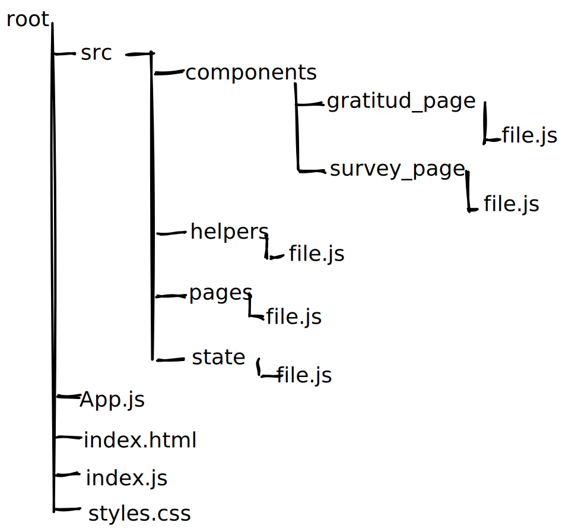

# Frontend Mentor - Interactive rating component solution

This is a solution to the [Interactive rating component challenge on Frontend Mentor](https://www.frontendmentor.io/challenges/interactive-rating-component-koxpeBUmI). Frontend Mentor challenges help you improve your coding skills by building realistic projects. 

## Table of contents

- [Frontend Mentor - Interactive rating component solution](#frontend-mentor---interactive-rating-component-solution)
  - [Table of contents](#table-of-contents)
  - [Overview](#overview)
    - [The challenge](#the-challenge)
    - [Screenshot (expected Results)](#screenshot-expected-results)
      - [Desktop design:](#desktop-design)
      - [Mobile design:](#mobile-design)
    - [Links](#links)
  - [My process](#my-process)
    - [Built with](#built-with)
    - [File System](#file-system)
    - [Useful resources](#useful-resources)
  - [Author](#author)
  - [Acknowledgments](#acknowledgments)

## Overview

### The challenge

Users should be able to:

- View the optimal layout for the app depending on their device's screen size
- See hover states for all interactive elements on the page
- Select and submit a number rating
- See the "Thank you" card state after submitting a rating

### Screenshot (expected Results)

#### Desktop design:

#### Mobile design:

### Links

<a src="" target="_blank">Live site </a> - visit the live interactive rating component.

## My process

### Built with

- HTML5 markup
- CSS
- CSS animate
- Flexbox
- Vanilla JavaScript
  
### File System

Component approach is used in this challange for better readable code, so the project was splited into pages and each page with components, the target was to make components that fit into one viewport of a 13" of a laptop screen.

### Useful resources

<a href="https://animate.style" target="_blank">Animate CSS</a>  - This helped me for adding back in and back out animations.

## Author

- Website - [Add your name here](https://www.your-site.com)
- Frontend Mentor - [@yourusername](https://www.frontendmentor.io/profile/yourusername)
- Twitter - [@yourusername](https://www.twitter.com/yourusername)

**Note: Delete this note and add/remove/edit lines above based on what links you'd like to share.**

## Acknowledgments

This is where you can give a hat tip to anyone who helped you out on this project. Perhaps you worked in a team or got some inspiration from someone else's solution. This is the perfect place to give them some credit.

**Note: Delete this note and edit this section's content as necessary. If you completed this challenge by yourself, feel free to delete this section entirely.**
